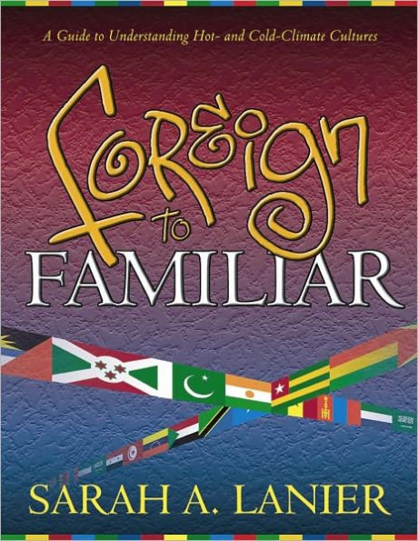

# Lost in Translation: Bridge Any Cultural Gap in 30 Seconds

A concise slide deck about bridging hot‑culture and cold‑culture communication styles so teams can connect faster and work better together.

  
   
  <em>Inspired by "Foreign to Familiar" by Sarah A. Lanier</em>

## View the slides

- Online deck: [https://dev-muhammad.github.io/cultural-bridge](https://dev-muhammad.github.io/cultural-bridge/slides/index.html)
- Outline as Markdown: [slides.md](slides.md)

## What the slides cover

- Why cultural lenses matter (Hot vs Cold)
- Recognizable phrases that create mismatched expectations
- A simple comparison framework you can remember
- Three practical tools you can use in any conversation
- A short, action‑focused close for the audience

## Presenter & duration

- Presenter: [Muhammad Abdugafarov](https://www.linkedin.com/in/muhammad-abdugafarov/)
- Duration: ~5 minutes (lightning talk)

## Attribution

- Draws on ideas from the book “Foreign to Familiar” by Sarah A. Lanier — https://www.foreigntofamiliar.com/

- All credit for the book and its ideas belongs to the author. Image used for educational purposes.
